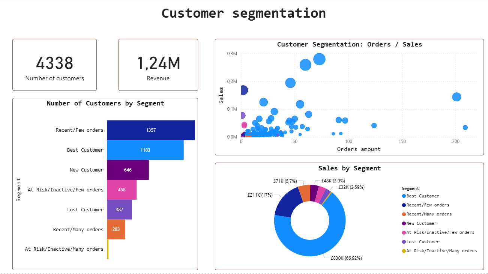

# Customer_Segmentation

## Project overview
Segmentation of an e-commerce customer base using RFM analysis (Recency, Frequency, Monetary). This approach helps identify loyal customers, detect those at risk of loosing, and develop personalized marketing strategies for each specific group.

## Tech Stack
* **Python (Pandas, Jupyter):** Used for data cleaning, handling missing values, and initial data preprocessing.

* **SQL (MS SQL Server):** Employed for calculating RFM metrics (Recency, Frequency, Monetary) and performing customer segmentation.

* **Power BI:** Utilized for building an interactive dashboard to visualize segment distributions and business KPIs.

## Workflow
**Data Cleaning (Python)**
  * Removed missing Customer ID transactions.
  * Filtered out canceled orders (identified by 'C' in the Invoice field).
  * Handled null values.
  * Converted Customer ID from float to integer to ensure proper table relationships.

**RFM Calculation (SQL)**
Three key metrics were calculated for each customer:
  * Recency: Number of days since the last purchase.
  * Frequency: Total number of unique orders.
  * Monetary: Total amount spent by the customer.

Each metric was assigned a score from 1 to 5 using quantiles and logical ranges.

**Segmentstion**
The database was divided into 7 segments:
* Best Customers (recent orders, many orders, and large checks)
* New Customers (those who recently placed their first order)
* Lost Customers (those who have not purchased for more than 270 days)
* Recent/Few orders (recent orders, few orders)
* Recent/Many orders (recent orders, many orders)
* At Risk/Inactive/Few Orders (former loyal customers who have not returned for a long time)
* At Risk/Inactive/Many Orders (former loyal customers who have not returned for a long time)

## Conclusion
The **"Best Customers"** segment accounts for only ~27% of the total customer base (1183 out of 4338) but generates 66.92% of total revenue (830K). The **"Recent/Few orders"** segment is the largest group (1357 customers) but contributes only 17% of revenue. This indicates a high number of first-time customers who have not yet transitioned into loyal, repeat ones.
The **"At Risk"** and **"Lost Customer"** segments combined include over 800 individuals. Most of these lost customers were characterized by a low average order value.
Although the **"Recent/Many orders"** segment is relatively small (283 customers), it contributes 5.7% (71K) of revenue. These are future "Best Customers".

## Recommendations
Best Customers:
* Offer exclusive rewards or early access to premium new arrivals.
* Focus on building a VIP community to maintain high engagement and lifetime value.

New Customers:
* Send a personalized welcome email with a time-limited discount code.
* Goal is to create a sense of urgency to encourage a second purchase and establish a buying habit.

At Risk & Lost Customers:
* Implement a "We miss you" email campaign with a soft reminder.
* Avoid aggressive marketing, instead offer a small bonus or ask for feedback to identify why they stopped buying.

## Description of project folders
1. Data is located in the `/data` folder.
2. The processing script can be viewed in `/jupyter`.
3. SQL queries are available in `/SQL`.
4. Interactive dashoards are in `/Power BI`.

